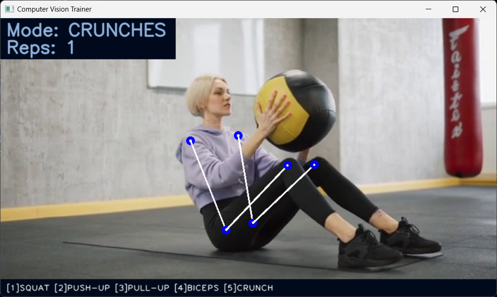

# Computer Vision Fitness Trainer

## Descripcion
Este proyecto es una herramienta de visión por computadora para detectar y contar repeticiones de ejercicios físicos como sentadillas, lagartijas, dominadas, curls de bíceps y abdominales. Utiliza OpenCV y MediaPipe para analizar video en tiempo real y calcular los movimientos corporales necesarios para identificar el tipo de ejercicio y realizar el conteo.

## Características
- Soporte para múltiples ejercicios:
  - Sentadillas (Squats)
  - Lagartijas (Push-ups)
  - Dominadas (Pull-ups)
  - Curls de bíceps (Biceps curls)
  - Abdominales (Crunches)
- Detección en tiempo real: Procesa video en vivo desde una cámara o archivo de video.
- Cambio de ejercicio: Cambia entre los diferentes modos de ejercicio con las teclas del teclado.
- Interfaz visual: Muestra información sobre el modo actual y el número de repeticiones directamente en el video.
